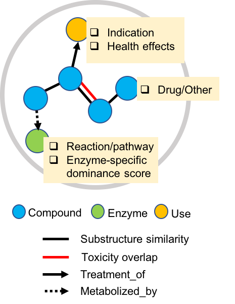

# microbeFDT-neo4j

# About microbeFDT
The gut microbiota complements host-driven metabolism of dietary compounds and xenobiotics, such as therapeutic drugs. Some gastrointestinally-routed drugs with uncharacterized metabolism and downstream effects on patients, have overlapping chemical properties with dietary compounds and thus may share gut microbiota enzymatic susceptibilities. Here, we present a database, MicrobeFDT, which predicts food and drug susceptibility to microbial metabolism by clustering chemically similar drug and food compounds and linking these compounds to microbial enzymes and known toxicities. We hypothesize that the chemical structures of dietary compounds metabolized by bacteria can be used to infer microbial metabolism of uncharacterized drugs with overlapping chemical similarity. We identify therapeutic drugs with potential microbiota-mediated toxicity, highlight understudied microbial enzyme families that may influence drug metabolism and identify drug-food-microbiome interactions that may alter microbiome function and influence host phenotypes.



* [Install](#install)
* [Connect](#connect)
* [Nodes](#nodes)
* [Relationships](#relationships)
* [Cypher](#cypher)
* [Drivers](#drivers)
* [Neo4j-APOC](#neo4j-apoc)


## <a name="#install"></a>Install

### Neo4j

Neo4j is an open source graph database. To interact with the MicrobeFDT database you will need to [download Neo4j](http://neo4j.com/download/other-releases/) and follow their instructions for your operating system. MicrobeFDT is run on the Community Edition 3.4.4. 


## <a name="#connect"></a>Connect

### Clone this respoitory.
```
git clone https://github.com/ltcguthrie/microbeFDT-neo4j.git
cd microbeFDT-neo4j
```

There are two files in the microbeFDT-neo4j sub directory.

* microbeFDT-neo4j/microbeFDT/MicrobefdtNeo4jgraph.zip
* microbeFDT-neo4j/microbeFDT/guides.zip

### Move and unzip *MicrobefdtNeo4jgraph.zip* in the neo4j databases directory

cd neo4j-community-3.4.4/data/databases
cp $pathtofile/$database_file .
unzip MicrobefdtNeo4jgraph.zip

### Move and unzip *guides.zip* in the root of your neo4j  directory

cd neo4j-community-3.4.4/
cp $pathtofile/guides.zip .
unzip guides.zip

### Open the neo4j browser

```
./bin/neo4j console
```

```
Starting Neo4j.
2018-07-31 10:51:31.661+0000 INFO  ======== Neo4j 3.4.4 ========
2018-07-31 10:51:31.750+0000 INFO  Starting...
2018-07-31 10:51:35.761+0000 INFO  Bolt enabled on 127.0.0.1:7687.
2018-07-31 10:51:39.992+0000 INFO  Started.
2018-07-31 10:51:41.831+0000 WARN  Low configured threads: (max={} - required={})={} < warnAt={} for {}
2018-07-31 10:51:41.850+0000 INFO  Remote interface available at http://localhost:7474/
```

### Create a neo4j login

By default your login and password credentials are:

**login:** neo4j

**password:** neo4j

After logging in you will be prompted to change your password.

### Run MicrobeFDT neo4j guide in browser

For help getting started run the microbefdt guide.

In a new terminal window navigate to the guides directory.

```
cd neo4j-microbeFDT/guides
```
Run the local python server.

```
python http-server.py
```

In the neo4j browser run:

```
:play http://localhost:8001/microbeFDT.html
```

## <a name="#nodes"></a>Nodes

### Nodes

| Node                          | Properties              | Property Description                |
|-------------------------------|-------------------------|-------------------------------------|
| Compound                      | cpID                    | PubChem CID                         |
|                               | name                    | Compound name                       |
|                               | type_OtherMultiCpd_drug | Status as therapeutic drug or other |
| Enzyme                        | enzymeID                | Unique ID code                      |
|                               | ec_class                | Enzyme Class                        |
|                               | ecsd_score              | Enzyme specific dominance scores    |
|                               | enzymeECnum             | Enzyme Commision ID                 |
|                               | hmpGenomeCount          | Count across Genomes in HMP         |
|                               | hmpMetagenomeCount      | Count across  Metagenomes in HMP    |
| Use                           | ATC_mainGroup           | 1st level, anatomical main group    |
|                               | ATC_TherapeuticGroup    | 2nd level, therapeutic subgroup     |
|                               | ATC_Pharmaologicalsub   | 3rd level, pharmacological subgroup |
|                               | ATC_ChemicalGroup       | 4th level, chemical subgroup        |
|                               | ATC_codeID              | 5th level, chemical substance      |

## <a name="#relationships"></a>Relationships


### Relationships


| Relationship                  | Properties | Property Description                |
|-------------------------------|------------|-------------------------------------|
| HAS_SUBSTRUCTURE_OVERLAP_WITH | score      | Pairwise substructure overlap score |
| HAS_TOX_OVERLAP_WITH          | score      | Pairwise toxicity overlap score     |
| METABOLIZED_BY                |            |                                     |
| TREATMENT_FOR                 |            |                                     |

## <a name="#cypher"></a>Cypher

[Cypher Documentation](https://neo4j.com/developer/cypher-query-language/)

### Enzyme-based search
```
MATCH p=()-[r:METABOLIZED_BY]->(n:Enzyme)
WHERE n.enzymeECnum = '3.2.1.31' 
RETURN p LIMIT 100
```

### Toxicity-based search

```
MATCH p=(c:Compound)-[r:HAS_TOX_OVERLAP_WITH]->(c1:Compound)
WHERE r.score > 0.5
RETURN c.cpdID,c1.cpdID,r.score
```

## <a name="#drivers"></a>Drivers

### Drivers

There are a number of driver that provide access to Neo4j from a variety of [supported languages](https://neo4j.com/developer/language-guides/).

* [Rneo4j](https://github.com/nicolewhite/RNeo4j)
* [Py2neo](https://neo4j.com/developer/python/#_py2neo)

### Rneo4j Example

Running this example assumes that neo4jis running in the background.

```r
library(RNeo4j)
```

## Connecto the graph

```r
graph = startGraph("http://127.0.0.1:7474/db/data/", username = "neo4j", password = "microbetest")
graph
```

## Query the database with cypher

```r
query = "MATCH p=()-[r:METABOLIZED_BY]->(n:Enzyme) RETURN n.enzymeID,n.ec_class,n.ecsd_score"
cypher(graph, query)
```
### output

```r

                              n.enzymeID  n.ec_class n.ecsd_score
1 (23-dihydroxybenzoyl)adenylate-synthase Transferase    0.6515893
2 (23-dihydroxybenzoyl)adenylate-synthase Transferase    0.6515893
3                           (d)CMP-kinase Transferase    0.9362530
4                           (d)CMP-kinase Transferase    0.9362530
5                (R)-citramalate-synthase Transferase    0.5533522
6                (R)-citramalate-synthase Transferase    0.5533522
```

## <a name="#neo4j-apoc"></a>Neo4j-APOC


### Neo4j-APOC

The Awesome Procedures for Neo4j (APOC) library extends user options for data analysis and conversion beyond the limitations of CYPHER.

For more information can be found at the [APOC github repository](https://github.com/neo4j-contrib/neo4j-apoc-procedures).


